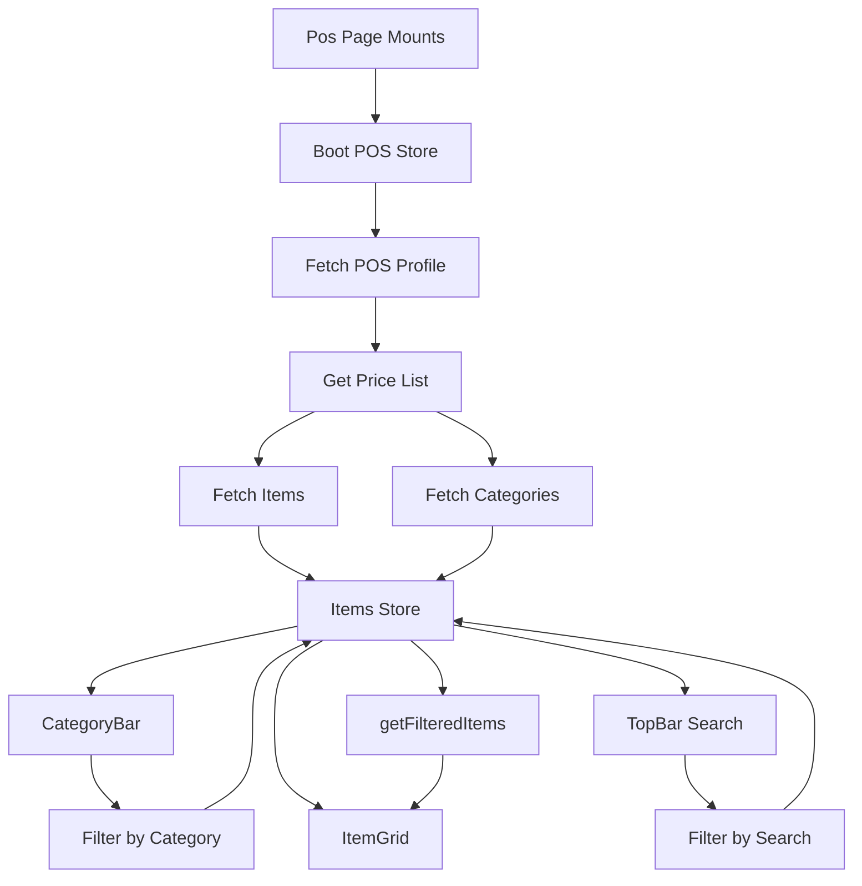

# Backend Integration Summary

## Overview
Successfully replaced all hardcoded values with dynamic data from the Frappe/ERPNext backend.

## Changes Made

### 1. **Enhanced Item Type** 
📄 [types/item.ts](file:///home/vyshnav/Tridz/pos2-bench/apps/tridz_pos/frontend/src/types/item.ts)

Added comprehensive fields to support full POS functionality:
- `item_code` - Unique item identifier
- `item_group` - Category/group classification
- `image` - Product image URL
- `standard_rate` - Price
- `actual_qty` - Stock quantity
- `description` - Item description

### 2. **Enhanced API Functions**
📄 [api/items.ts](file:///home/vyshnav/Tridz/pos2-bench/apps/tridz_pos/frontend/src/api/items.ts)

**Updated `getItems()`:**
- Fetches all necessary fields from backend
- Increased limit to 500 items
- Filters for enabled sales items only

**Added `getItemGroups()`:**
- Fetches item categories from backend
- Filters for leaf categories only (not parent groups)

### 3. **Created Items Store**
📄 [store/itemsStore.ts](file:///home/vyshnav/Tridz/pos2-bench/apps/tridz_pos/frontend/src/store/itemsStore.ts)

New Zustand store managing:
- **State:**
  - `items[]` - All items from backend
  - `categories[]` - Dynamic category list
  - `selectedCategory` - Active filter
  - `searchTerm` - Search query
  - `loading` - Loading state
  - `error` - Error messages

- **Actions:**
  - `fetchItems()` - Load items from API
  - `fetchCategories()` - Load categories from API
  - `setCategory()` - Filter by category
  - `setSearchTerm()` - Filter by search
  - `getFilteredItems()` - Get filtered results

### 4. **Updated CategoryBar Component**
📄 [components/layout/CategoryBar.tsx](file:///home/vyshnav/Tridz/pos2-bench/apps/tridz_pos/frontend/src/components/layout/CategoryBar.tsx)

**Before:** Hardcoded 8 categories
**After:** 
- Dynamic categories from backend
- Active category highlighting
- Click to filter functionality

### 5. **Updated TopBar Component**
📄 [components/layout/TopBar.tsx](file:///home/vyshnav/Tridz/pos2-bench/apps/tridz_pos/frontend/src/components/layout/TopBar.tsx)

**Added:**
- Connected search input to items store
- Real-time filtering as user types
- Searches by item name OR item code

### 6. **Updated ItemCard Component**
📄 [components/items/ItemCard.tsx](file:///home/vyshnav/Tridz/pos2-bench/apps/tridz_pos/frontend/src/components/items/ItemCard.tsx)

**Before:** Hardcoded "Coca Cola 500ml" data
**After:**
- Accepts `item` prop from backend
- Displays real product image (with fallback)
- Shows actual price, stock, and item code
- Color-coded stock levels:
  - 🟢 Green: Stock > 50
  - 🟠 Orange: Stock 10-50
  - 🔴 Red: Stock < 10
- Disabled add button when out of stock
- Integrates with cart store

### 7. **Updated ItemGrid Component**
📄 [components/items/ItemGrid.tsx](file:///home/vyshnav/Tridz/pos2-bench/apps/tridz_pos/frontend/src/components/items/ItemGrid.tsx)

**Before:** Displayed 12 hardcoded placeholder cards
**After:**
- Fetches filtered items from store
- Loading state with message
- Empty state when no items found
- Maps real items to ItemCard components

### 8. **Updated Pos Page**
📄 [pages/Pos.tsx](file:///home/vyshnav/Tridz/pos2-bench/apps/tridz_pos/frontend/src/pages/Pos.tsx)

**Added data initialization:**
- `useEffect` to boot POS on mount
- Fetches POS profile and opening entry
- Loads items and categories once profile is ready
- Uses `selling_price_list` from profile

## Data Flow



## Features Implemented

### ✅ Dynamic Categories
- Categories loaded from ERPNext Item Groups
- "All Items" option automatically added
- Active category highlighting
- Click to filter

### ✅ Real-time Search
- Search by item name or code
- Case-insensitive matching
- Instant filtering

### ✅ Product Display
- Real product images with fallback
- Actual prices from backend
- Live stock quantities
- Color-coded stock indicators

### ✅ Cart Integration
- Add items to cart with correct structure
- Maps Item → CartItem format
- Validates stock before adding

### ✅ Loading States
- Loading indicator while fetching
- Empty state when no results
- Error handling in stores

## Backend Requirements

The frontend now expects these Frappe DocTypes with fields:

### Item DocType
```
- name (string)
- item_code (string)
- item_name (string)
- item_group (string)
- stock_uom (string)
- image (string, optional)
- standard_rate (float, optional)
- description (text, optional)
- disabled (boolean)
- is_sales_item (boolean)
```

### Item Group DocType
```
- name (string)
- parent_item_group (string)
- is_group (boolean)
```

### POS Profile DocType
```
- name (string)
- company (string)
- currency (string)
- selling_price_list (string)
- warehouse (string)
```

## Testing Checklist

- [x] Build compiles without errors
- [ ] Categories load from backend
- [ ] Items display with real data
- [ ] Search filters correctly
- [ ] Category filtering works
- [ ] Add to cart functions
- [ ] Stock colors display correctly
- [ ] Images load or show fallback
- [ ] Loading states appear
- [ ] Empty states show when appropriate

## Next Steps

1. **Test with real backend data**
   - Ensure Frappe instance has items configured
   - Verify POS Profile exists
   - Check Item Groups are set up

2. **Add stock quantity fetching**
   - Currently using `actual_qty` from Item
   - May need to query Bin DocType for real-time stock

3. **Add error handling UI**
   - Toast notifications for API errors
   - Retry mechanisms
   - Offline mode support

4. **Performance optimization**
   - Implement pagination for large item lists
   - Add debouncing to search input
   - Cache frequently accessed data

---

**Build Status:** ✅ Success  
**Files Modified:** 8  
**Files Created:** 1  
**Lines Changed:** ~200
